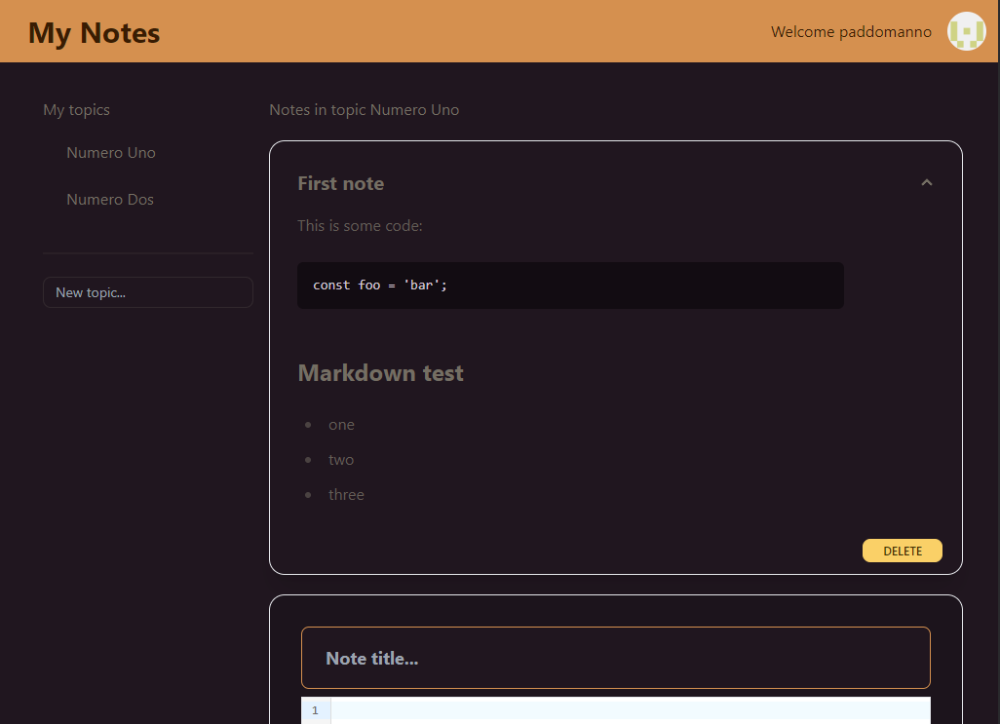

# My Notes App

A full-stack web app for writing and organizing markdown notes, built with the latest web technologies.

# Tech Stack

This is a [T3 Stack](https://create.t3.gg/) project bootstrapped with `create-t3-app`.

- [Next.js 13](https://nextjs.org)
- Typescript
- [NextAuth.js](https://next-auth.js.org)
- [Prisma](https://prisma.io)
- [Tailwind CSS](https://tailwindcss.com)
- [tRPC](https://trpc.io)
- DaisyUI

## Screenshot

## Note

- This project is currently unmaintained and not working due to issues with the backend hosting service.
- There is no live demo hosted at the moment.
- A GitHub account is required to use this app.

## How I made this

1. `npx create-t3-app@latest`
1. Set-up database
   1. Create new Supabase project and copy the URI
   1. change db provider to postgresql in `schema.prisma`
   1. put db URI in .env
   1. `npx prisma db push`
1. Set-up GitHub OAuth
   1. Register new OAuth App on GitHub and generate secret token (dev and prod)
   1. Change 'Discord' to 'Github' in `src/env.mjs` and `src/server/auth.ts`
   1. Generate NextAuth secret and save in .env
   1. Save GitHub client id and secret in .env (dev and prod)
1. Deploy to Vercel
   1. Push repo to GitHub
   1. Login on Vercel.com and create new project from repo
   1. Add environment variables to project on Vercel and deploy
1. Add UI
   1. install daisyui and @tailwindcss/typography
1. Add tables to database
   1. add topic and note models in prisma schema
   1. `npx prisma db push`

## Feature ideas

- [ ] Link markdown guide
- [ ] Easily accessible markdown cheat sheet
- [ ] Add discord auth
- [ ] Edit notes
- [ ] Move note to different topic
- [ ] Rename / delete topic
- [ ] Tag notes
- [ ] Give notes a color
- [ ] Show notes in grid/list
- [ ] Sort notes by date / updated / title
- [ ] Filter notes by tag
- [ ] Placeholder data, maybe use a demo acc without auth?
- [ ] Dark/Light themes
- [ ] Search for notes
- [ ] Markdown preview while writing
